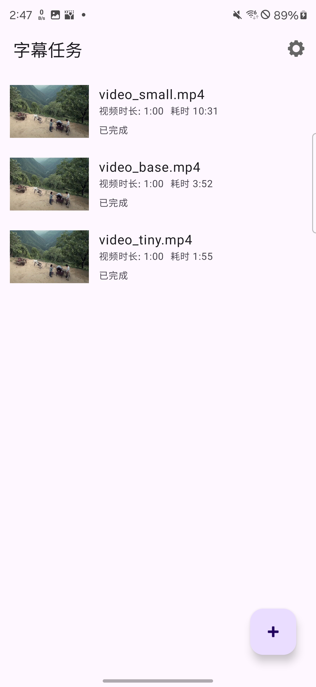
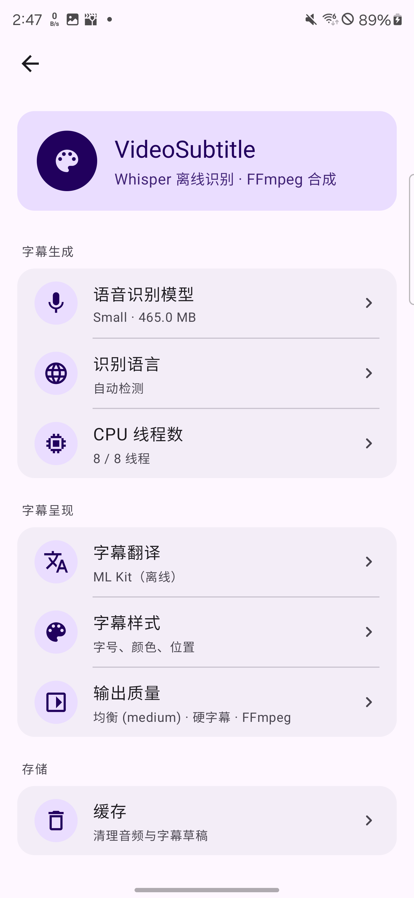
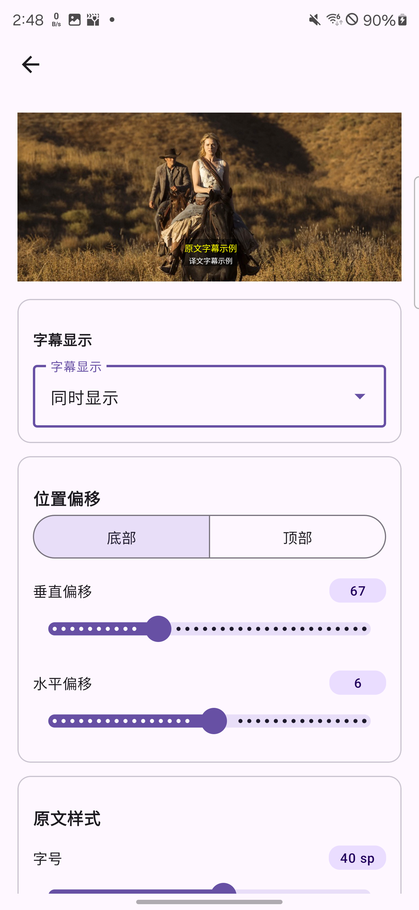

# VideoSubtitle

[English](./README.md) | [中文](./README_zh.md)

An Android app for the offline pipeline **Pick a local video → transcribe with whisper.cpp on-device → edit subtitles → burn them back into the video with FFmpeg → save to the system gallery**. 

## Screenshots

| Task list | Settings | Subtitle style |
| :---: | :---: | :---: |
|  |  |  |

## Performance benchmark

Measured on a **Samsung Galaxy S24 Ultra** (Qualcomm Snapdragon 8 Gen 3 for Galaxy, 4 nm; Adreno 750 GPU) with a **1:00 / 720p** source video. End-to-end wall-clock for the full pipeline (extract → transcribe → translate → burn):

| Whisper model | Total time |
| --- | --- |
| `tiny` | 1:55 |
| `base` | 3:52 |
| `small` | 10:31 |

Transcription dominates total time; extract / translate / burn together run in well under a minute on this device.

## Spec-Driven Development (how this project works)

This project is built **spec-first**, not code-first. The two docs below are the contract; the code is the implementation of that contract. **Read them in order before writing or reviewing any non-trivial change.**

1. [`docs/SDD.md`](./docs/SDD.md) — Spec / Design Document. Goals & non-goals (§1), end-to-end user flow (§2), layered architecture (§3), tech-stack decisions with rationale (§4), MVVM conventions (§5), the data pipeline with exact FFmpeg / Whisper command shapes (§6), domain model (§7), risk register (§8), build & permission checklist (§11), v1 acceptance criteria (§12).
2. [`docs/IMPLEMENTATION_PLAN.md`](./docs/IMPLEMENTATION_PLAN.md) — Phased build-out (Phase 0 scaffold → Phase 8 Android Media backend). Each phase carries: explicit goal, key deliverables (code + docs), acceptance tests, risks. **Currently at end of Phase 8.**

**SDD process rules** (carried from `IMPLEMENTATION_PLAN.md` and `CLAUDE.md`):

- **Spec before code.** New behavior gets specified in `SDD.md` (and decomposed in `IMPLEMENTATION_PLAN.md`) *before* the first commit lands.
- **Phase-gated.** Don't start phase N+1 until phase N's acceptance criteria are met and verified.
- **Interface-first within a phase.** Each data source / Repository ships its interface and a Fake first; UI consumes the Fake; real implementation swaps in later. UI and infra advance in parallel without blocking each other.
- **Test-with-code.** Domain / data pure logic ships with JVM unit tests in the same commit. UI layer tests are limited to ViewModel state.
- **Small reversible commits.** Each phase is broken into 3–6 independently compilable commits.
- **Divergences update the spec in the same change.** If you intentionally deviate from the SDD, edit the SDD in the same diff — never let code and spec drift silently. Current tracked divergences are listed at the bottom of this README.
- **Reference implementation, not a clone.** Python desktop [`VideoCaptioner`](https://github.com/WEIFENG2333/VideoCaptioner) is referenced for the FFmpeg / Whisper command shapes in §6 and §10; we do not reproduce its LLM, translation, or downloader features as part of v1.

## Invariants (from SDD §1.4)

These are load-bearing — touch with care:

- **Offline-first.** ASR and subtitle burn run entirely on-device; no audio/video/text leaves the phone on the default path. The optional online translation providers (Baidu/Youdao/Tencent/Microsoft) are an explicit, opt-in extension beyond v1 scope; the default translator is **ML Kit on-device**.
- **MVVM.** Single Activity + Navigation Component + Fragments. UI state is `StateFlow<UiState>`; one-shot events go through `SharedFlow`/`Channel`, never inside `UiState`.
- **XML + ViewBinding only.** No Compose. RecyclerView for lists & editor.
- **Domain layer has no Android types.** `Uri` → cached `File` conversion happens at the repository boundary; use cases take/return primitives, `File`, and domain models only.
- **Long-running work belongs to repositories, not ViewModels.** `TaskRepository` (application-scoped) owns transcription/burn task state so it survives ViewModel recreation and process death; ViewModels are projections.
- **Pipeline steps are idempotent on disk.** Each phase writes to `cacheDir/tasks/<taskId>/` (`source.<ext>`, `audio.wav`, `subtitle.srt`, `subtitle.original.srt`, …) so a killed/restored task can skip already-completed steps. On app start, `TaskRepository.recoverInterrupted()` rewinds in-progress tasks to the closest completed step based on disk artifacts; recovery never auto-resumes — the user re-runs explicitly.

## Pipeline (SDD §6)

```
Uri ──[1]──▶ cacheDir/tasks/<id>/source.<ext>    ──[2]──▶ audio.wav (16kHz mono PCM)
                                                                │
                                                                ▼
                                                       [3] Whisper inference  → SubtitleSegment[]
                                                                │
                                                                ▼
                                                       [4] subtitle.srt (+ optional translated)
                                                                │
                                                                ▼
                                                       [5] FFmpeg burn (hard or soft)
                                                                │
                                                                ▼
                                                       [6] MediaStore.Movies/VideoSubtitle/
```

Total progress is a weighted sum: **extract 5% + transcribe 70% + burn 25%**.

Step shapes mirror VideoCaptioner verbatim:
- **Extract** (`-i in -map 0:a:0 -vn -ac 1 -ar 16000 -y out.wav`) — same as `videocaptioner/core/utils/video_utils.py:video2audio`.
- **Burn — hard** (re-encode, default): `-vcodec libx264 -crf 23 -preset <preset> -vf "subtitles='<srt>'"`. Same as `add_subtitles`.
- **Burn — soft** (mp4/mov only, no re-encode): `-c:v copy -c:a copy -c:s mov_text`.

Steps [2] and [5] are routed through `RoutingMediaEngine` (`data/engine/RoutingMediaEngine.kt`), which dispatches to either the FFmpeg path above or the Android Media (Media3 Transformer + MediaCodec) path based on the user's "Processing engine" setting. See **Processing engine** below for the fallback rule.

Disk-space gate: Extract and Burn refuse to start if `cacheDir` has less than `2 × source.length()` free (`StatFs`).

## Features

- **Local SAF picker** with `takePersistableUriPermission` so background tasks can re-open the URI after app restart.
- **Whisper models** — Tiny / Base / Small (GGML, downloaded from HuggingFace, **SHA-256 verified**); mismatched downloads fail loud rather than feed corrupt weights to whisper.cpp.
- **Multi-language transcription** — Auto / 中文 / English / 日本語 / 한국어, with per-language `initial_prompt` to nudge the decoder (full-width punctuation for Chinese, etc.).
- **Hard or soft subtitle burn** — hard re-encode (any container) or `mov_text` mux (mp4/mov, faster).
- **Processing engine (FFmpeg vs Android Media)** — user-selectable in Settings → Output. **FFmpeg (Software)** is the default: full libass styling, broadest container compatibility, slower on long videos. **Android Media (Hardware)** routes through Media3 Transformer + MediaCodec for hardware decode + encode and `OverlayEffect` subtitle compositing on the GPU; faster on long videos. The hardware path can't reproduce libass `{\fs..\c..}` per-line overrides, so when bilingual subtitles use distinct styling for the translated track, that single burn call silently falls back to FFmpeg. Both paths honor the same `BurnOptions` shape.
- **Subtitle text/timing editor** — RecyclerView per-segment editing with back-press unsaved-changes confirm.
- **Subtitle style editor** — font size 16–60 sp, color, outline, 9-grid alignment, vertical/horizontal margin, optional translucent background, with a 1080×720 preview that scales correctly to phone screens.
- **Bilingual output (post-v1 extension)** — keep original only, translated only, or both stacked, each with its own font size / color. Default translator is ML Kit on-device; online providers are opt-in and break the offline-first invariant.
- **Concurrency** — Extract & Burn run in parallel across tasks; **Transcription is serial** (multiple concurrent Whisper instances measured slower than serial on-device).
- **Foreground service** — `VideoProcessingService` keeps the process alive during long jobs and posts a single rolling notification with progress + Cancel action.
- **Bulk actions** — long-press → multi-select → bulk delete or "Start" the full pipeline for all selected items.
- **i18n** — Simplified Chinese (default) + English UI strings; keep parity when adding strings.

## Tech stack (SDD §4)

| Concern | Choice |
| --- | --- |
| Build | Gradle wrapper, AGP **9.1.1**, version catalog (`gradle/libs.versions.toml`) |
| UI | XML + ViewBinding + Navigation Component + Fragment (no Compose) |
| Async | Coroutines + Flow; long tasks on application-scoped `SupervisorJob+IO` |
| DI | **Koin 4.1.0** — Hilt has no AGP-9-compatible release yet (SDD §4.3) |
| Persistence | Room (`androidx.room` plugin schema export) + Preferences DataStore + file-based SRT |
| Networking | OkHttp (model download with SHA-256 verify) |
| Image loading | Coil (video thumbnails) |
| ASR | Vendored `whisper.cpp` v1.7.5 under `app/src/main/cpp/whisper.cpp/`, NDK + CMake → `libwhisper.so`. Kotlin facade at `com.whispercpp.whisper.WhisperLib` (`object`, stable JNI symbols) |
| Video / Audio | FFmpegKit `6.0.LTS` (`ffmpeg-kit-full-gpl`, includes libass + fontconfig + freetype). Pulled from Aliyun / HuaweiCloud Maven mirrors since FFmpegKit was removed from Maven Central in 2025; `content { includeGroup("com.arthenica") }` in `settings.gradle.kts` strictly isolates these mirrors |
| Hardware path (optional) | Media3 Transformer `1.4.1` (`androidx.media3:media3-transformer/effect/common`) — MediaCodec hardware decode + encode, `OverlayEffect` for subtitle compositing. Selected per user via Settings → Output; FFmpeg remains the default and the only path with full libass parity |
| Translation (offline) | Google ML Kit on-device translation |
| Logging | Timber |
| Tests | JUnit4 + Truth + Turbine + MockK; Espresso reserved for core paths |

## Build & run

Use the Gradle wrapper from the repo root:

```bash
./gradlew :app:assembleDebug          # debug APK
./gradlew :app:installDebug           # install on connected device/emulator
./gradlew :app:assembleRelease        # R8-shrunk release APK (~31 MB arm64-v8a, target ≤ 80 MB)
./gradlew :app:lint                   # report under app/build/reports/lint-results-*.html
./gradlew :app:testDebugUnitTest      # JVM unit tests (app/src/test)
./gradlew :app:connectedDebugAndroidTest   # instrumented tests (needs device/emulator)
./gradlew clean
```

ABIs: `arm64-v8a` + `armeabi-v7a` via `splits.abi`. If you build on an x86_64 emulator, add `x86_64` to the include list **locally** — don't commit it. Release APK is currently **unsigned** (signing config deferred). Crashlytics/Sentry deferred to v1.1.

## v1 acceptance criteria (SDD §12)

1. On a Pixel-class arm64-v8a device, a 5-minute 1080p mp4 with the `base` model runs end-to-end and the output is playable from the system gallery.
2. While a task is running, backgrounding the app → process kill → relaunch shows the task recovered (or surfaces the failure and offers retry).
3. Mandarin ASR character-error-rate vs. VideoCaptioner desktop on the same model + video differs by ≤ 2%.
4. `ffprobe` on a hard-burn output shows no subtitle stream; on a soft-burn output shows a `mov_text` stream.
5. After uninstalling the app, files in `Movies/VideoSubtitle/` remain (handed off to MediaStore's user domain).

## Project layout (load-bearing pieces)

```
app/src/main/cpp/                          ← vendored whisper.cpp + JNI bridge → libwhisper.so
app/src/main/java/com/whispercpp/whisper/  ← WhisperLib.kt (Kotlin facade, stable JNI symbols)
app/src/main/java/com/frank/videosubtitle/
├── VideoSubtitleApp.kt                    ← Application + Koin + Timber + libass font dirs
├── MainActivity.kt                        ← single Activity, NavHostFragment, edge-to-edge
├── di/                                    ← AppModule / DataModule / UiModule (Koin)
├── domain/{model,engine,usecase}/         ← no Android types here
├── data/
│   ├── engine/                            ← FFmpegKitEngine, WhisperJniEngine, translation engines
│   ├── orchestrator/TaskOrchestrator.kt   ← extract → transcribe → editing → burn, idempotent
│   ├── repository/                        ← TaskRepository (recoverInterrupted), Video / Model / Settings
│   └── source/{local,media}/              ← Room + SrtSerializer + UriResolver + MediaStoreSaver
├── service/VideoProcessingService.kt      ← FGS, rolling notification, Cancel action
└── ui/{home,progress,editor,settings,common}/
```

`stageKind` strings (`idle/extracting/transcribing/editing/burning/done/failed`) are persisted in Room — renaming them is a schema break, pinned by `TaskMappersTest`.

## Toolchain gotchas

A couple of non-obvious ones — full list lives in [`CLAUDE.md`](./CLAUDE.md):

- AGP 9.0+ has built-in Kotlin support — do **not** apply `org.jetbrains.kotlin.android` (it's actively rejected, see issuetracker.google.com/438678642).
- Hilt isn't AGP-9-compatible yet; project uses Koin (SDD §4.3).
- `whisper-jni` ships only desktop binaries (macOS/Linux/Windows GLIBC), so we vendor `whisper.cpp` source instead.
- libass on Android needs explicit font-directory setup — see `VideoSubtitleApp.onCreate()`. Without it, burn re-encodes successfully but every glyph renders blank.
- API 34+ FGS uses type **`dataSync`**, not `mediaProcessing` (Android 16 / targetSdk 36 rejects `mediaProcessing` starts with `InvalidForegroundServiceTypeException`). This is a deliberate divergence from SDD §11; both share the same 6h/day quota.
- Media3 burn fallback is automatic: `RoutingMediaEngine.burnSubtitles` checks `BurnOptions.fontSizeTranslated` / `fontColorTranslatedArgb` / `outlineWidthTranslated`; any one being non-null forces the FFmpeg path even when "Android Media" is selected. The hint under the radio button in Settings → Output explains this to users; Timber logs the routing decision so it's debuggable from `adb logcat`.

## Divergences from SDD

Documented for traceability:
- **Translation pipeline (post-Phase-7).** SDD §1.3 lists translation as a v1 non-goal. The current build adds a translation step (Whisper → translate → bilingual SRT) with ML Kit as the offline default. The four online providers explicitly violate the offline-first invariant and are opt-in.
- **FGS type.** SDD §11 declared `mediaProcessing`; runtime forced a switch to `dataSync` on targetSdk 36 (see above).
- **Hilt → Koin.** Tracked in SDD §4.3.

## License

Not yet declared.
